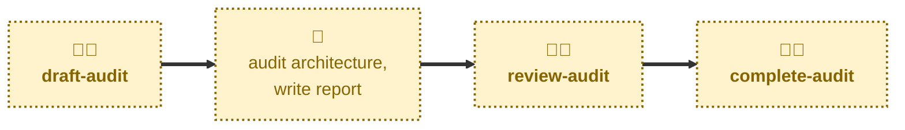

# Agent skills

The following skills are available to support the management of architecture
audit reports via AI agents.

- **[draft-audit](./draft-audit/):** \
  Scaffolds a new, blank audit report.
  Cuts an `audit/<slug>` branch from `main`, prepares a fresh report from the
  template, and opens a pull request in a draft state.

- **[review-audit](./review-audit/):** \
  Checks an audit report has enough substance for review, and takes its pull
  request out of draft.

- **[complete-audit](./complete-audit/):** \
  Checks an audit report and merges it into the `main` trunk.

## Workflow

The agent skills in this project are focused on the mechanics of managing the
lifecycle of architecture audit reports.
For help doing to the audit itself — evaluating the as-built system architecture
and writing up the findings in a new audit report — you may instruct agents to use
the [**audit**](https://github.com/kieranpotts/skills/tree/latest/dev/skills/audit)
skill in my global skills collection.

## Compatibility

These skills are compatible with the [Agent Skills](https://agentskills.io/)
convention. Most agent harnesses support this convention natively, but
workarounds may be required for harnesses that do not.
