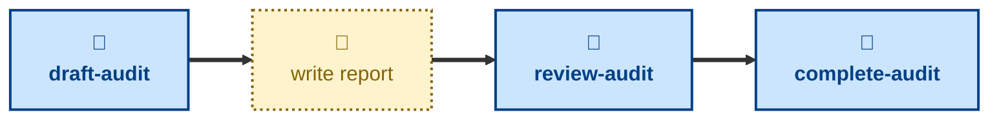

# Agent skills for managing architecture audit reports

The skills available to agents in this project are:

- **[draft-audit](./draft-audit/):** \
  Cuts an `audit/<slug>` branch from `main`, prepares a fresh report from the
  template, and opens a pull request in a draft state.

- **[review-audit](./review-audit/):** \
  Checks the report has enough substance for review, and takes the pull
  request out of draft.

- **[complete-audit](./complete-audit/):** \
  Checks the audit report and merges it into the `main` trunk.

The **draft-audit** skill prepares a new, blank audit report. After this step,
the user will do the actual architecture audit and write up the report. Once
there's enough to review, **review-audit** takes the pull request out of
draft. When done, the **complete-audit** skill can be used to get an agent to
check it over and land the report in the `main` trunk.

These skills handle process, not substance: how an audit report is drafted,
reviewed, and landed in `main`. For the audit work itself — evaluating the
architecture and writing up the findings — use the
[**audit**](https://github.com/kieranpotts/skills/tree/latest/dev/skills/audit)
skill in my global skills collection.

## Compatibility

These skills are compatible with the [Agent Skills](https://agentskills.io/)
convention. Most agent harnesses support this convention natively, but
workarounds may be required for harnesses that do not.
