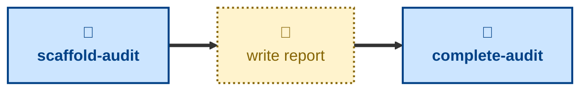

# Agent skills for managing architecture audit reports

The skills available to agents in this project are:

- **[scaffold-audit](./scaffold-audit/):** \
  Cuts an `audit/<slug>` branch from `main`, fills in some initial details,
  and opens a draft pull request.

- **[complete-audit](./complete-audit/):** \
  After the reviews have been completed, this skill can be used to land
  the audit report in the `main` trunk.

The **scaffold-audit** skill prepares a new, blank audit report. After this step,
the user will do the architecture audit and write up the report. When the report
is done, the **complete-audit** skill can be used to get an agent to check it
over and land the report in the `main` trunk.

For help with the actual architecture audit itself, or for help writing a report,
see the [**audit**](https://github.com/kieranpotts/skills/tree/latest/dev/skills/audit)
skill in my global skills collection.

## Compatibility

These skills are compatible with the [Agent Skills](https://agentskills.io/)
convention. Most agent harnesses support this convention natively, but
workarounds may be required for harnesses that do not.
