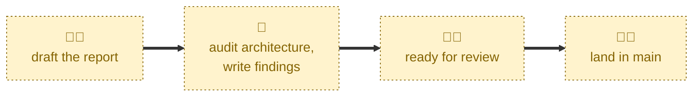

# Complete audit

Checks an audit report is settled, then squash-merges it into the `main`
trunk.

Before merging, the agent verifies the pull request is out of draft, that no
review threads are left unresolved, and that the report's row is present in
`audits/INDEX.md`. It then asks you to confirm, squash-merges, and deletes the
`audit/<slug>` branch upstream. The report's content is never edited — once on
`main`, an audit report is an immutable snapshot.

## Interactivity

This skill is interactive, and deliberately so. It always stops to ask for
explicit confirmation before merging, and it may also ask which pull request
to land when it cannot infer the target from the checked-out branch.

Because the confirmation gate is unconditional, this skill cannot be used in
unattended, away-from-keyboard workflows. That is intentional: merging is
irreversible in practice, since reports on `main` are never amended.

## How to invoke

From an `audit/*` branch:

> Complete audit.

> Complete this audit.

> Merge the audit.

> This audit is complete.

Or name the target:

> Complete #42.

> Complete the most recent audit.

## Recommended models

A mid-tier model. The merge itself is mechanical, but judging whether review
feedback is genuinely settled — as opposed to merely marked resolved — takes
a little more reasoning than the other steps in this workflow.

## Suggested workflows

Run this last, after review feedback has been gathered and resolved. Do not
run it to "tidy up" a stale audit branch whose report was never finished:
an incomplete report on `main` cannot be fixed later, only superseded by a
whole new audit.

## Related skills

- [**draft-audit**](../draft-audit/) \
  Runs first, creating the branch, the report, and the index row that this
  skill checks for before merging.

- [**review-audit**](../review-audit/) \
  Runs immediately before, taking the pull request out of draft. This skill
  refuses to merge until that has happened.

## References

- [Contributing guidelines](../../../CONTRIBUTING.md) \
  The audit workflow, including the merge conventions this skill follows.
