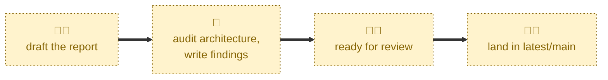

# Draft audit

Scaffolds a new, blank architecture audit report.

Cuts an `latest/audit/<slug>` branch from `latest/main`, copies `audits/TEMPLATE.md`
into `audits/YYYY-MM-DD-<slug>/README.md`, fills in the header metadata,
prepends a row to `audits/INDEX.md`, and opens a draft pull request. The body of
the report is left as template placeholders — the agent is explicitly told not
to evaluate the architecture or write findings.

## Interactivity

This skill is interactive. The agent may pause to ask you for the audit's
scope — the system, subsystem, or service under audit, and ideally the commit
it is pinned to — if it cannot work that out from the conversation or the
workspace. Auditors and the audit date are inferred, and the agent asks about
those only if inference fails.

Because it can block on a question, this skill is not suited to unattended
runs. Supply the scope in your invoking prompt if you want it to run straight
through.

## How to invoke

> Draft an audit.

> Draft a new audit report.

> Prepare a new audit report.

> Start an architectural review.

Include the scope in the prompt to avoid being asked for it:

> Prepare an audit of the payment service, at acme/payments-service@a1b2c3d.

## Recommended models

A fast, cheap model is sufficient. The work is mechanical file and Git
plumbing; no architectural judgment is exercised at this stage.

## Suggested workflows

Run this once, at the very start of an audit, before any evaluation work
begins. You then do the audit itself and write the findings into the report
by hand, or with the help of a general-purpose audit skill.

Do not run this skill to record a reassessment of a system that has already
been audited. Audit reports are immutable snapshots, so a reassessment is a
new report — which is exactly what this skill produces.

## Related skills

- [**review-audit**](../review-audit/) \
  Run next, once you have written up enough findings for colleagues to weigh
  in on. It takes the pull request this skill opened out of draft.

- [**complete-audit**](../complete-audit/) \
  Runs last, squash-merging the pull request this skill opened into `latest/main`
  and deleting the `audit/<slug>` branch.

## References

- [Contributing guidelines](../../../CONTRIBUTING.md) \
  The step-by-step audit workflow this skill automates the first part of.

- [Audit report template](../../../audits/TEMPLATE.md) \
  The report structure the scaffolded report is copied from.
