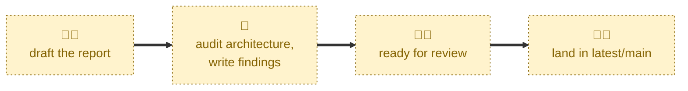

# Review audit

Checks that an audit report has enough substance for review, and takes its
pull request out of draft.

The bar is deliberately low: header metadata filled in, at least one finding
written up with a type, a priority, and a location, and no leftover template
placeholders. Sections like "themes" and "priorities" are allowed to be thin,
since those usually firm up in response to review feedback. The agent is told
to report gaps rather than fix them, so the report's content is never touched.

## Interactivity

This skill is interactive, but only barely. The agent may ask you which audit
report to check, and it only does so when it cannot infer the target from the
checked-out `latest/audit/<slug>` branch — for example when you run it from
`latest/main`.

Run it from the audit branch, or name the pull request in your prompt, and it
will complete without stopping to ask anything.

## How to invoke

Run from an `latest/audit/*` branch:

> Review audit.

> Review this audit.

> This audit is ready for review.

> Take the audit out of draft.

> Mark the audit ready for review.

Or name the target pull request:

> Review #42.

## Recommended models

A fast, cheap model is sufficient. The completeness check is a shallow,
mechanical comparison against the template, and the report itself is left
untouched.

## Suggested workflows

Run this once the findings are written up well enough to be worth other
people's attention — not when the report is finished. Landing feedback early
is the point of the draft-to-ready transition.

## Related skills

- [**draft-audit**](../draft-audit/) \
  Runs first, creating the branch, the report, and the draft pull request that
  this skill later marks ready.

- [**complete-audit**](../complete-audit/) \
  Runs next, once review feedback is settled, squash-merging the report into
  `latest/main`.

## References

- [Contributing guidelines](../../../CONTRIBUTING.md) \
  The audit workflow this skill implements the draft-to-ready transition of.
